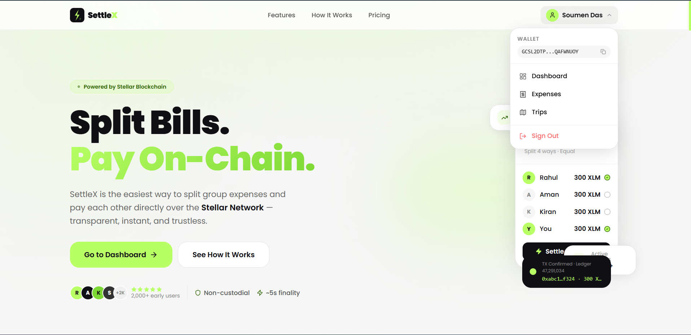
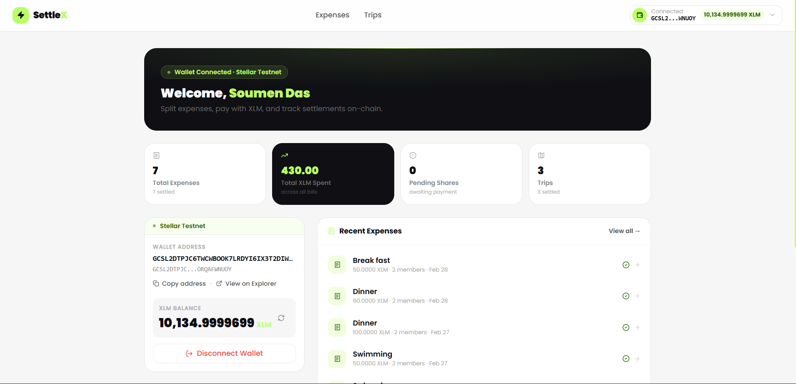
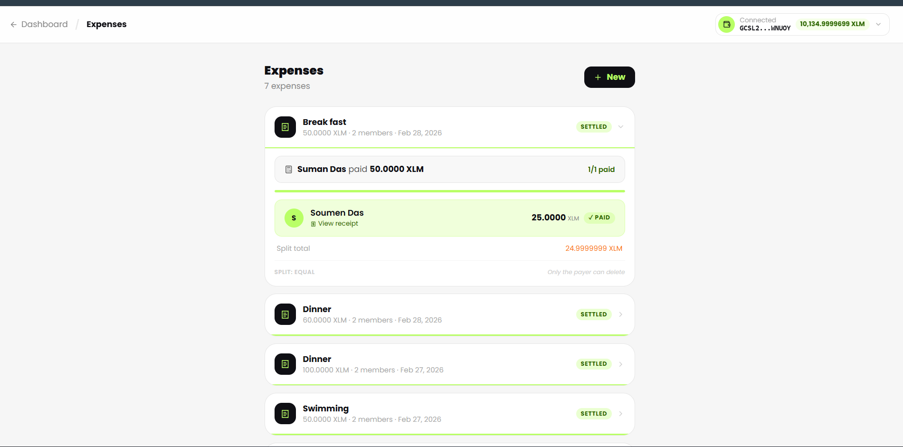
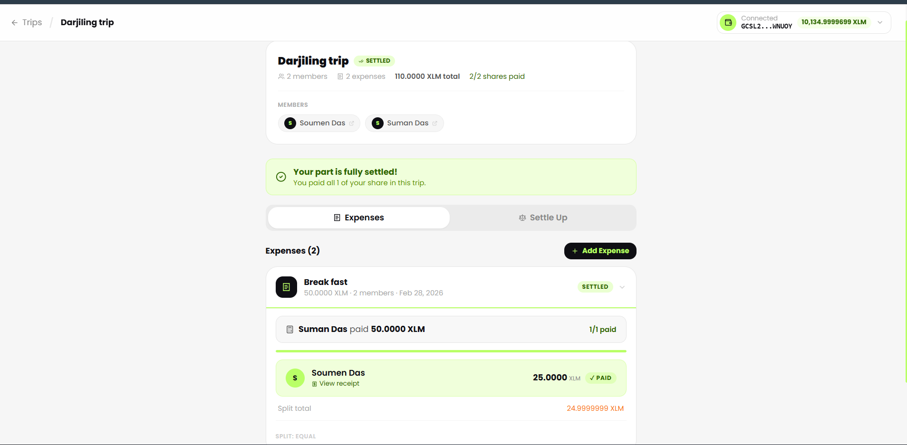
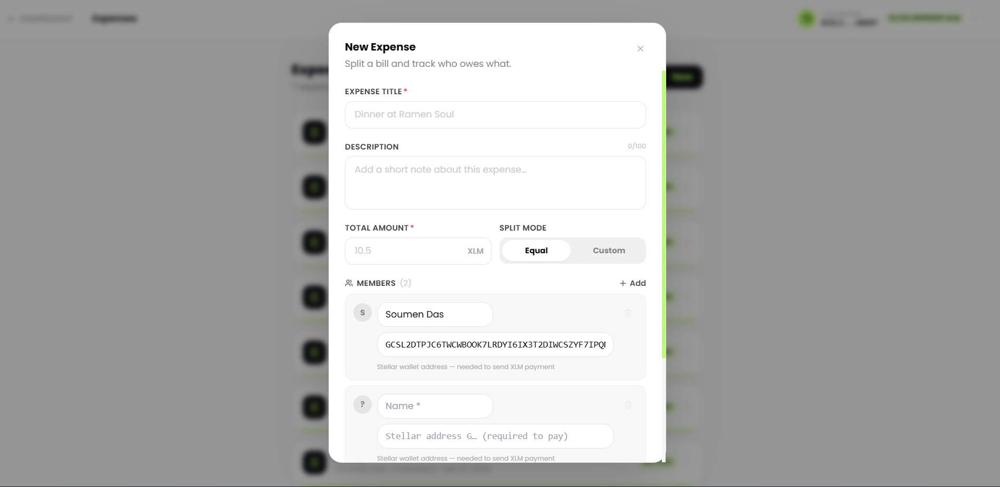
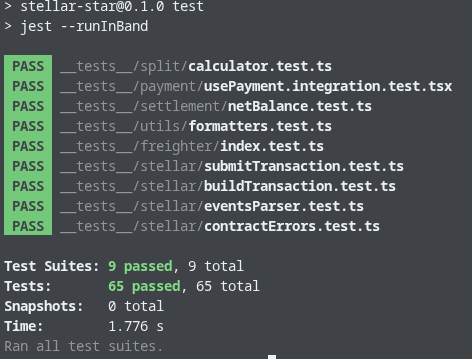

<p align="center">
  
</p>

<h1 align="center">SettleX - Split Bills. Pay On-Chain.</h1>

<p align="center">
  Decentralized expense splitting on Stellar Testnet.<br/>
  Create expenses, split by equal/percentage/weight, and settle shares with real XLM transfers and verifiable transaction hashes.
</p>

<p align="center">
  <a href="https://settle-x-pi.vercel.app/"><strong>Live Demo</strong></a>
  &nbsp;&bull;&nbsp;
  <a href="https://youtu.be/gnUaUONmb3I"><strong>Demo Video</strong></a>
</p>

---

## Table of Contents

- [Project Description](#project-description)
- [Features](#features)
- [Tech Stack](#tech-stack)
- [Screenshots](#screenshots)
- [How It Works](#how-it-works)
- [Smart Contract](#smart-contract)
- [Submission Checklist Evidence](#submission-checklist-evidence)
- [Quick Start](#quick-start)
- [Environment Variables](#environment-variables)
- [Testing](#testing)
- [Deployment](#deployment)
- [Project Structure](#project-structure)
- [Documentation](#documentation)
- [License](#license)

---

## Project Description

SettleX solves the common "IOU but no payment" problem in group expense apps.
Most split apps only track debts. SettleX closes the loop by letting members settle instantly with XLM and verify results on-chain.

Every payment can be traced through an explorer transaction hash, and settlement metadata is stored via Soroban contract calls for transparency and dispute resistance.

Core properties:

- Non-custodial: users sign with their own wallet.
- On-chain verifiable: each payment has a real tx hash.
- Multi-wallet UX: Freighter, xBull, Lobstr support.
- Realtime sync: Supabase updates shared state across participants.

---

## Features

| Feature | Status |
| --- | --- |
| Multi-wallet connect (Freighter, xBull, Lobstr) | Live |
| Expense split modes (equal, percentage, weighted/custom) | Live |
| Per-share XLM settlement flow | Live |
| Soroban duplicate-settlement checks (`is_paid`) | Live |
| On-chain payment recording (`record_payment`) | Live |
| Transaction hash receipt links | Live |
| SEP-0007 QR generation | Live |
| Trip net-balance optimization | Live |
| Realtime sync (Supabase + contract events) | Live |
| Responsive mobile-first UI | Live |

---

## Tech Stack

| Layer | Technology |
| --- | --- |
| App Framework | Next.js 15 (App Router) + TypeScript |
| UI | Tailwind CSS, Framer Motion, Radix UI |
| Blockchain | @stellar/stellar-sdk, Horizon, Soroban RPC |
| Smart Contract | Rust + soroban-sdk |
| Data Sync | Supabase (PostgreSQL + Realtime) |
| Testing | Jest + ts-jest + React Testing Library |

---

## Screenshots

### Landing Page



### Dashboard



### Expenses Page



### Trips Page



### New Expense Form



### Test Output



---

## How It Works

```text
Connect wallet -> Create expense -> Choose split mode -> Calculate shares
  -> Build/sign XLM transaction -> Submit to Horizon
  -> Record settlement metadata on Soroban
  -> Sync confirmed state across members via events + Supabase
```

Flow summary:

1. User connects wallet (Freighter/xBull/Lobstr).
2. Expense is created with split strategy and participant weights.
3. App computes each member share in XLM.
4. Payment transaction is built client-side and signed in wallet.
5. Signed envelope is submitted to Horizon.
6. Contract read/write checks enforce no duplicate settlement.
7. UI updates from tx hash receipts, event polling, and realtime sync.

---

## Smart Contract

Latest deployed settlement contract (this workspace session):

- Contract ID:
  - `CBS2BJQ4ZC2ZSAZ5XS47BGC6Q7VTMJA4SE2PVHFXGXAZI5ES6H645WHO`
- Deploy transaction:
  - https://stellar.expert/explorer/testnet/tx/4d0304dc8b176aac73686f4590dbe883df9fc555aa3a41a6e6462a285abff8e4
- Contract explorer:
  - https://stellar.expert/explorer/testnet/contract/CBS2BJQ4ZC2ZSAZ5XS47BGC6Q7VTMJA4SE2PVHFXGXAZI5ES6H645WHO

### Verified On-Chain Transactions

- Settlement deploy tx:
  - https://stellar.expert/explorer/testnet/tx/826092e11281bd8fe3c8997ef0a4886b1bd3728069c6855ec4e3866f0a8f9d06
- Pool deploy tx:
  - https://stellar.expert/explorer/testnet/tx/fa245da3ce0a478a9146cccdfa0b1b7f918985c0c138dec3f061f104e5b8f39e
- Pool init tx (`pool_ini`):
  - https://stellar.expert/explorer/testnet/tx/a04a0a2f79e06448156b52ebd07060281cab5bee323889e92c584e0aaf50546d
- Settlement init tx (`stx_ini`):
  - https://stellar.expert/explorer/testnet/tx/f05c2f59f980a00e99f3f00d57e22b8b10fd0405064096273fd912c9b05a037e
- Inter-contract settlement proof tx (`record_payment` + internal pool `withdraw`):
  - https://stellar.expert/explorer/testnet/tx/04c679c7ab7ec960db505038b4c6ec1f367e5d3caae013696bf3111e493de967

Main contract functions used by the app:

- `record_payment(trip_id, expense_id, payer, member, amount, tx_hash)`
- `get_payments(trip_id)`
- `is_paid(expense_id, member)`

Contract guarantees leveraged by frontend:

- Prevent duplicate settlement for same expense/member pair.
- Persist immutable settlement evidence (`tx_hash`).
- Return payment history by trip for reconciliation.

Frontend-handled contract error mapping:

- `InvalidAmount` (#1): amount is zero or negative.
- `AlreadyPaid` (#2): duplicate settlement attempt.
- `EmptyId` (#3): missing trip or expense identifier.

---

## Submission Checklist Evidence

| Requirement | Evidence |
| --- | --- |
| Public repository | https://github.com/soumen0818/SettleX |
| Live demo | https://settle-x-pi.vercel.app/ |
| Demo video | https://youtu.be/gnUaUONmb3I |
| Contract details and tx proof | Smart Contract section in this README |
| UI screenshots | Screenshots section in this README |
| Test output screenshot | `public/testcase.png` |
| Release/runbook/proof docs | [Documentation](#documentation) section |

---

## Quick Start

### Prerequisites

- Node.js 18+
- npm 9+
- Rust toolchain (for contract work)
- Stellar CLI (for contract deploy)
- Freighter wallet set to Testnet

### Install and run

```bash
npm install
npm run dev
```

Open http://localhost:3000

If this is your first run:

1. Copy env template.
2. Add Supabase URL and anon key.
3. Ensure wallet is on Stellar Testnet.

```bash
cp .env.local.example .env.local
```

---

## Environment Variables

Use `.env.local` (or copy from `.env.local.example`):

```env
NEXT_PUBLIC_STELLAR_NETWORK=TESTNET
NEXT_PUBLIC_HORIZON_URL=https://horizon-testnet.stellar.org
NEXT_PUBLIC_STELLAR_EXPLORER=https://stellar.expert/explorer/testnet

NEXT_PUBLIC_SOROBAN_RPC_URL=https://soroban-testnet.stellar.org
NEXT_PUBLIC_CONTRACT_ID=CBS2BJQ4ZC2ZSAZ5XS47BGC6Q7VTMJA4SE2PVHFXGXAZI5ES6H645WHO

NEXT_PUBLIC_SUPABASE_URL=https://your-project.supabase.co
NEXT_PUBLIC_SUPABASE_ANON_KEY=your-anon-key-here

NEXT_PUBLIC_APP_NAME=SettleX
NEXT_PUBLIC_APP_VERSION=1.0.0
NEXT_PUBLIC_SITE_URL=https://settle-x-pi.vercel.app
```

---

## Testing

Run all frontend/unit tests:

```bash
npm test -- --runInBand
```

Coverage:

```bash
npm run test:coverage
```

Current status in this workspace:

- Run `npm test -- --runInBand` to see the latest total suites/tests after any new test cases are added.
- Run `npm run lint`, `npx tsc --noEmit`, and `npm run build` for release checks.

For Rust contract checks:

```bash
cd contract
cargo check
# optional
cargo test
```

Suggested pre-release verification checklist:

- Run `npm run lint`.
- Run `npx tsc --noEmit`.
- Run `npm test -- --runInBand`.
- Run `npm run build`.
- Run `cd contract && cargo check`.

---

## Deployment

### App build

```bash
npm run build
npm run start
```

### Contract deploy (Stellar Testnet)

Script:

```bash
bash scripts/deploy-contract.sh <stellar-cli-account-alias-or-secret>
```

Example:

```bash
bash scripts/deploy-contract.sh settlex-deployer
```

After deployment, update:

- `NEXT_PUBLIC_CONTRACT_ID` in `.env.local`

Notes:

- If script is not executable in your shell, run it via `bash scripts/deploy-contract.sh <alias-or-secret>`.
- Always verify returned tx/contract ID on Stellar Expert before updating docs.

---

## Project Structure

```text
app/                 Next.js app routes
components/          UI and feature components
context/             React context providers
hooks/               App hooks (wallet, payment, events, etc.)
lib/                 Utilities, Stellar integration, Supabase client
contract/            Soroban Rust smart contract
__tests__/           Jest test suites
docs/                Runbook, checklist, architecture, requirement matrix
scripts/             Deployment scripts
types/               Shared TypeScript types
```

---

## Documentation

- [Release Checklist](docs/RELEASE_CHECKLIST.md)
- [Production Runbook](docs/RUNBOOK.md)
- [Requirement Proof Matrix](docs/REQUIREMENT_PROOF_MATRIX.md)
- [Architecture and Limitations](docs/ARCHITECTURE_AND_LIMITATIONS.md)

---

## License

MIT (2026) SettleX
