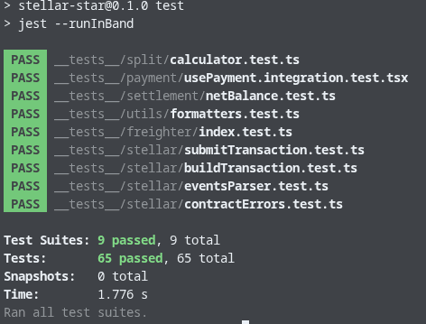

<p align="center">
  <a href="https://stellar-star-five.vercel.app/">
    <picture>
     <source media="(prefers-color-scheme: light)" srcset="https://img.shields.io/badge/%E2%AD%90_Stellar--star-Split_Bills._Pay_On--Chain.-0F0F14?style=for-the-badge&labelColor=white&color=2DD4BF" />
      
    </picture>
  </a>
</p>

<div align="center">
  <div style="display: inline-flex; align-items: center; justify-content: center; gap: 10px; background: white; border-radius: 16px; padding: 24px 40px;">
    <span style="font-size: 1.5rem; line-height: 1;">⭐</span>
    <h2 style="margin: 0;"><span style="color: #0F0F14;">Stellar</span><span style="color: #2DD4BF;">-Star</span></h2>
  </div>
</div>

<h1 align="center">⚡ Stellar-star - Split Bills. Pay On-Chain.</h1>

<p align="center">
  <em>Decentralized expense splitting on Stellar Testnet.</em><br/>
  Create expenses, split by equal/percentage/weight, and settle shares<br/>
  with real XLM transfers and verifiable transaction hashes.
</p>

<p align="center">
  <a href="https://stellar-star-five.vercel.app/"></a>
  &nbsp;
  <a href="https://youtu.be/Lh3TgpQHMng?si=dfwqbK7LiI2gAdQt"></a>
  &nbsp;
  <a href="https://github.com/Soumen1080/stellar-star"></a>
  &nbsp;
  <a href="https://github.com/Soumen1080/stellar-star/actions/workflows/ci.yml"></a>
</p>

<br/>

---

## Table of Contents

| # | Section |
|---|---------|
| 1 | [📖 Project Description](#project-description) |
| 2 | [✨ Features](#features) |
| 3 | [🛠️ Tech Stack](#tech-stack) |
| 4 | [📸 Screenshots](#screenshots) |
| 5 | [🔄 How It Works](#how-it-works) |
| 6 | [📜 Smart Contract](#smart-contract) |
| 7 | [✅ Submission Checklist Evidence](#submission-checklist-evidence) |
| 8 | [🚀 Quick Start](#quick-start) |
| 9 | [🔐 Environment Variables](#environment-variables) |
| 10 | [🧪 Testing](#testing) |
| 11 | [🚢 Deployment](#deployment) |
| 12 | [📁 Project Structure](#project-structure) |
| 13 | [📚 Documentation](#documentation) |
| 14 | [📄 License](#license) |

---

## Project Description

> **Stellar-star** solves the common *"IOU but no payment"* problem in group expense apps.

Most split apps only track debts. **Stellar-star closes the loop** by letting members settle instantly with XLM and verify results on-chain.

Every payment can be traced through an explorer transaction hash, and settlement metadata is stored via Soroban contract calls for **transparency** and **dispute resistance**.

### 🔑 Core Properties

| Property | Description |
|----------|-------------|
| 🔐 **Non-custodial** | Users sign with their own wallet |
| 🔗 **On-chain verifiable** | Each payment has a real tx hash |
| 💼 **Multi-wallet UX** | Freighter, xBull, Lobstr support |
| ⚡ **Realtime sync** | Supabase updates shared state across participants |

---

## Features

| Feature | Status |
|---------|--------|
| Multi-wallet connect (Freighter, xBull, Lobstr) | ✅ Live |
| Expense split modes (equal, percentage, weighted/custom) | ✅ Live |
| Per-share XLM settlement flow | ✅ Live |
| Soroban duplicate-settlement checks (`is_paid`) | ✅ Live |
| On-chain payment recording (`record_payment`) | ✅ Live |
| Transaction hash receipt links | ✅ Live |
| SEP-0007 QR generation | ✅ Live |
| Trip net-balance optimization | ✅ Live |
| Realtime sync (Supabase + contract events) | ✅ Live |
| Responsive mobile-first UI | ✅ Live |
| Duplicate wallet address validation (trip and expense forms) | ✅ Live |

---

## Tech Stack

| Layer | Technology |
|-------|------------|
| **App Framework** | Next.js 15 (App Router) + TypeScript |
| **UI** | Tailwind CSS, Framer Motion, Radix UI |
| **Blockchain** | @stellar/stellar-sdk, Horizon, Soroban RPC |
| **Smart Contract** | Rust + soroban-sdk |
| **Data Sync** | Supabase (PostgreSQL + Realtime) |
| **Testing** | Jest + ts-jest + React Testing Library |

---

## Screenshots

<details>
<summary><strong>📱 Mobile Views</strong></summary>
<br/>

### Landing Page on Phone


### Dashboard on Phone


### Mobile responsive proof


</details>

<details>
<summary><strong>🏠 Landing Page</strong></summary>
<br/>


</details>

<details>
<summary><strong>📊 Dashboard</strong></summary>
<br/>


</details>

<details>
<summary><strong>💰 Expenses Page</strong></summary>
<br/>


</details>

<details>
<summary><strong>🧳 Trips Page</strong></summary>
<br/>


</details>

<details>
<summary><strong>📝 New Expense Form</strong></summary>
<br/>


</details>

<details>
<summary><strong>🧪 Test Output</strong></summary>
<br/>



</details>

---

## How It Works

```
┌─────────────┐    ┌──────────────┐    ┌──────────────┐    ┌───────────────┐
│   Connect    │───▶│    Create     │───▶│  Choose Split │───▶│   Calculate   │
│   Wallet     │    │   Expense    │    │     Mode     │    │    Shares     │
└─────────────┘    └──────────────┘    └──────────────┘    └───────┬───────┘
                                                                   │
                   ┌──────────────┐    ┌──────────────┐    ┌───────▼───────┐
                   │  Sync State  │◀───│  Record on   │◀───│  Build/Sign   │
                   │  via Events  │    │   Soroban    │    │  & Submit TX  │
                   └──────────────┘    └──────────────┘    └───────────────┘
```

### 📋 Step-by-Step Flow

| Step | Action |
|------|--------|
| **1** | User connects wallet (Freighter / xBull / Lobstr) |
| **2** | Expense is created with split strategy and participant weights |
| **3** | App computes each member's share in XLM |
| **4** | Payment transaction is built client-side and signed in wallet |
| **5** | Signed envelope is submitted to Horizon |
| **6** | Contract read/write checks enforce no duplicate settlement |
| **7** | UI updates from tx hash receipts, event polling, and realtime sync |

---

## Smart Contract

> Latest deployed settlement contract (this workspace session):

> [!IMPORTANT]
> **The deployment below predates the v2 contracts** (attestation oracle, #144;
> multi-asset pool, #145). It runs v1 storage and the v1 ABI, so its
> `record_payment` takes no attestation and its pool is single-asset. The
> transaction links remain valid as historical proof of the deployed v1
> behaviour, which is why they are kept rather than removed.
>
> Redeploy with `./scripts/deploy-contract.sh` and update the IDs below before
> relying on v2 behaviour. Deploying the v2 wasm over this contract's existing
> storage is safe — the pool rolls its layout forward instead of trapping — but
> the settlement contract must be re-initialised, since v1 storage carries no
> oracle key or settlement asset. See
> [Multi-asset pool design](docs/DESIGN_MULTI_ASSET_POOL.md).

| Detail | Value |
|--------|-------|
| **Contract ID** | `CBS2BJQ4ZC2ZSAZ5XS47BGC6Q7VTMJA4SE2PVHFXGXAZI5ES6H645WHO` |
| **Storage version** | v1 — predates #144/#145 |
| **Deploy Transaction** | [View on Stellar Expert](https://stellar.expert/explorer/testnet/tx/4d0304dc8b176aac73686f4590dbe883df9fc555aa3a41a6e6462a285abff8e4) |
| **Contract Explorer** | [View Contract](https://stellar.expert/explorer/testnet/contract/CBS2BJQ4ZC2ZSAZ5XS47BGC6Q7VTMJA4SE2PVHFXGXAZI5ES6H645WHO) |

### ✅ Verified On-Chain Transactions

| Transaction | Link |
|-------------|------|
| Settlement deploy tx | [View](https://stellar.expert/explorer/testnet/tx/826092e11281bd8fe3c8997ef0a4886b1bd3728069c6855ec4e3866f0a8f9d06) |
| Pool deploy tx | [View](https://stellar.expert/explorer/testnet/tx/fa245da3ce0a478a9146cccdfa0b1b7f918985c0c138dec3f061f104e5b8f39e) |
| Pool init tx (`pool_ini`) | [View](https://stellar.expert/explorer/testnet/tx/a04a0a2f79e06448156b52ebd07060281cab5bee323889e92c584e0aaf50546d) |
| Settlement init tx (`stx_ini`) | [View](https://stellar.expert/explorer/testnet/tx/f05c2f59f980a00e99f3f00d57e22b8b10fd0405064096273fd912c9b05a037e) |
| Inter-contract settlement proof (`record_payment` + internal pool `withdraw`) | [View](https://stellar.expert/explorer/testnet/tx/04c679c7ab7ec960db505038b4c6ec1f367e5d3caae013696bf3111e493de967) |

The inter-contract call proved above is preserved in v2: `record_payment` still
calls the same pool contract, now through `withdraw_asset` so the debit follows
the attested asset. Choosing one multi-asset pool over a pool per asset is what
keeps this a single stable proof link rather than one per asset — see
[Multi-asset pool design](docs/DESIGN_MULTI_ASSET_POOL.md).

### 🔧 Main Contract Functions

```rust
// Settlement contract (storage v2)
init(admin, pool_contract, oracle_key, settlement_asset)
record_payment(trip_id, expense_id, payer, member, amount, tx_hash, attestation)
get_payments(trip_id)
is_paid(expense_id, member)
is_nonce_used(nonce)
set_oracle_key(oracle_key)          // admin only — rotation
get_oracle_key() / get_settlement_asset()
```

`record_payment` requires an oracle attestation signed over the full claim. See
[Attestation oracle design](docs/DESIGN_ATTESTATION_ORACLE.md).

### 💰 Settlement Pool Contract

The pool holds member balances keyed by **`(member, token)`**, so a settlement
denominated in one asset can never debit a balance denominated in another. When
recording a payment on-chain, the settlement contract calls the pool to withdraw
the member's share **in the attested asset**:

```rust
// Multi-asset entry points (storage v2)
deposit_asset(member, token, amount)
withdraw_asset(from, token, amount)
balance_of_asset(member, token)

// v1-compatible wrappers, defaulting to the pool's configured token
deposit(member, amount)
withdraw(from, amount)
balance_of(member)

// Asset registry and migration
get_supported_assets()
add_supported_asset(token)          // admin only
migrate(member)                     // idempotent; anyone may call
is_migrated(member) / get_version()
```

- **`deposit_asset` / `withdraw_asset`**: move credit in a named, allowlisted
  asset (requires the member's signature).
- **`balance_of_asset`**: the member's credit in that one asset.
- The v1-arity functions are retained so existing clients keep working; they
  resolve to the pool's configured default token.

**Migrating a live v1 pool:** deploy the v2 wasm to the same contract ID, then
run `./scripts/migrate-pool.sh <deployer> <pool-id> [member...]`. Instance
storage rolls forward on the first read and member balances migrate on first
touch, so the script is a convenience rather than a prerequisite, and it is
idempotent. See [Multi-asset pool design](docs/DESIGN_MULTI_ASSET_POOL.md).

### 🛡️ Contract Guarantees

- ✅ **Prevent duplicate settlement** for same expense/member pair
- ✅ **Persist immutable settlement evidence** (`tx_hash`)
- ✅ **Return payment history** by trip for reconciliation

### ⚠️ Frontend-Handled Contract Errors

| Error Code | Name | Description |
|------------|------|-------------|
| `#1` | `InvalidAmount` | Amount is zero or negative |
| `#2` | `AlreadyPaid` | Duplicate settlement attempt |
| `#3` | `EmptyId` | Missing trip or expense identifier |

---

## Submission Checklist Evidence

| Requirement | Evidence |
|-------------|----------|
| Public repository | [GitHub Repo](https://github.com/Soumen1080/stellar-star) |
| Live demo | [stellar-star-five.vercel.app](https://stellar-star-five.vercel.app/) |
| Demo video | [YouTube](https://youtu.be/gnUaUONmb3I) |
| Contract details and tx proof | [Smart Contract](#-smart-contract) section |
| UI screenshots | [Screenshots](#-screenshots) section |
| Mobile screenshot proof | `public/mobile-responsive.png` |
| Test output screenshot | `public/testcase.png` |
| Release/runbook/proof docs | [Documentation](#-documentation) section |

---

## Quick Start

### Prerequisites

| Requirement | Version |
|-------------|---------|
| Node.js | 18+ |
| npm | 9+ |
| Rust toolchain | Latest (for contract work) |
| Stellar CLI | Latest (for contract deploy) |
| Freighter wallet | Set to **Testnet** |

### Install and Run

```bash
# 1. Install dependencies
npm install

# 2. Start the dev server
npm run dev
```

> Open [http://localhost:3000](http://localhost:3000) in your browser.

**First time setup?**

```bash
# Copy the environment template
cp .env.local.example .env.local
```

Then:
1. Add your Supabase URL, anon key and JWT secret to `.env.local`
2. **Create the database schema** — open the Supabase Dashboard, go to
   **SQL Editor -> New Query**, paste the whole of [`supabase-setup.sql`](supabase-setup.sql)
   and hit **Run**. The script is idempotent, so it is safe to run again after
   any change.
3. Verify the connection end to end:

   ```bash
   npm run db:check
   ```

   This checks the env vars, confirms `SUPABASE_JWT_SECRET` really signs this
   project's tokens, proves the tables exist, and exercises the whole sign-up
   write path (including that one wallet cannot read or take over another
   wallet's rows). It cleans up everything it creates.
4. Ensure your wallet is on Stellar Testnet

> **Nothing loads after signing up?** That is almost always step 2: without the
> tables, every query returns `PGRST205` and the app falls back to an empty
> local cache. `npm run db:check` will tell you in one line.

---

## Database & Data Flow

| Layer | File | Responsibility |
| :---- | :--- | :------------- |
| Schema, RLS, triggers | [`supabase-setup.sql`](supabase-setup.sql) | Tables, policies, realtime, integrity triggers |
| Row types | `types/supabase.ts` | Typed mirror of the SQL schema |
| Session | `lib/supabase/session.ts` | Stores the wallet JWT; notifies React when it changes |
| Client | `lib/supabase/client.ts` | One shared client that attaches the current token per request |
| Queries | `lib/supabase/queries.ts` | Every read and write, plus row-to-domain mapping |
| Live data | `lib/supabase/useRealtimeCollection.ts` | Fetch + realtime + per-wallet offline cache |
| Server | `lib/supabase/server.ts` | Route-handler clients (never bundled for the browser) |

**Authentication.** There is no Supabase Auth user. `/api/auth/challenge` issues
a nonce, the wallet signs it, and `/api/auth/verify` checks the signature and
mints an HS256 JWT with a `wallet_address` claim, signed with the project's JWT
secret. Postgres verifies that token on every request, and every RLS policy
reads identity from it via `public.current_wallet()`. The same call also creates
or refreshes the user's profile, so sign-up completes in one round trip.

**Access control.** `member_wallets` is derived by a database trigger from the
`members` JSON, never sent by the client, so the array RLS filters on cannot
drift out of sync with the member list. `created_by_wallet` is frozen on update,
so a member can edit a shared trip or expense without taking ownership of it.

---

## Environment Variables

Use `.env.local` (or copy from `.env.local.example`):

```env
# ── Stellar Network ──────────────────────────────
NEXT_PUBLIC_STELLAR_NETWORK=TESTNET
NEXT_PUBLIC_HORIZON_URL=https://horizon-testnet.stellar.org
NEXT_PUBLIC_STELLAR_EXPLORER=https://stellar.expert/explorer/testnet

# ── Soroban / Smart Contract ─────────────────────
NEXT_PUBLIC_SOROBAN_RPC_URL=https://soroban-testnet.stellar.org
# Deployed contract ID (example or placeholder)
NEXT_PUBLIC_CONTRACT_ID=CBS2BJQ4ZC2ZSAZ5XS47BGC6Q7VTMJA4SE2PVHFXGXAZI5ES6H645WHO

# ── Supabase ─────────────────────────────────────
NEXT_PUBLIC_SUPABASE_URL=https://your-project.supabase.co
NEXT_PUBLIC_SUPABASE_ANON_KEY=your-anon-key-here
# Supabase JWT secret used for server-side auth challenge signatures
SUPABASE_JWT_SECRET=your-supabase-jwt-secret-here

# ── App Metadata ─────────────────────────────────
NEXT_PUBLIC_APP_NAME=Stellar-star
NEXT_PUBLIC_APP_VERSION=1.0.0
NEXT_PUBLIC_SITE_URL=http://localhost:3000
```

---

## Testing

**Run all frontend/unit tests:**

```bash
npm test -- --runInBand
```

**Generate coverage report:**

```bash
npm run test:coverage
```

**Run browser end-to-end tests (Playwright):**

```bash
npm run test:e2e            # headless, all projects (desktop + mobile viewports)
npm run test:e2e:ui         # interactive UI mode
npx playwright test --project=chromium   # single browser, fastest (what CI runs)
```

Playwright starts the dev server itself and covers landing, auth prompt,
dashboard, expenses, trips, and trip detail pages plus two mobile-viewport
(Pixel 5 / iPhone 12) tests - see `e2e/e2e.spec.ts`. No real wallet or
Supabase project is needed; it asserts unauthenticated-state UI and
responsive layout. Full details in `docs/RUNBOOK.md`.

**Verify proof assets & docs links (issue #73):**

```bash
npm run proof:links
```

This standalone script (script: `scripts/proof-link-check.js`) confirms that:

- `public/mobile-responsive.png` exists (the mobile viewport screenshot).
- `README.md` references the local mobile proof asset.
- All remote proof URLs in `README.md`, `docs/REQUIREMENT_PROOF_MATRIX.md`, `docs/ARCHITECTURE_AND_LIMITATIONS.md`, and `docs/RELEASE_CHECKLIST.md` resolve successfully.

It is also wired into the `quality` job of `.github/workflows/ci.yml`, so every PR and push to `main` runs the same checks.

**Current status in this workspace:**
- Run `npm test -- --runInBand` to see the latest total suites/tests after any new test cases are added.
- Run `npm run lint`, `npx tsc --noEmit`, `npm run proof:links`, and `npm run build` for release checks.
- Duplicate wallet address validation (trip and expense forms) is covered by `__tests__/split/calculator.test.ts`, `__tests__/hooks/useExpenseFormValidation.test.ts`, and `__tests__/components/trips/TripFormDuplicateWallet.test.tsx`.
- Pending on-chain retry persistence (localStorage, wallet-scoped, survives refresh) is covered by `__tests__/utils/pendingOnChain.test.ts` and `__tests__/payment/usePayment.retry-persistence.test.tsx`.

**For Rust contract checks:**

```bash
cd contract
cargo check
# optional
cargo test
```

### 📝 Pre-Release Verification Checklist

| # | Command | Purpose |
|---|---------|---------|
| 1 | `npm run lint` | Lint checks |
| 2 | `npx tsc --noEmit` | Type checking |
| 3 | `npm test -- --runInBand` | Run tests |
| 4 | `npm run proof:links` | Verify mobile proof asset & docs links |
| 5 | `npm run build` | Production build |
| 6 | `cd contract && cargo check` | Rust contract check |

---

## Deployment

### App Build

```bash
npm run build
npm run start
```

### Contract Deploy (Stellar Testnet)

**Script:**

```bash
bash scripts/deploy-contract.sh <stellar-cli-account-alias-or-secret> <token-contract-id>
```

**Example:**

```bash
bash scripts/deploy-contract.sh stellar-star-deployer C... # Stellar Asset Contract ID
```

Register additional pool assets at deploy time with `EXTRA_POOL_ASSETS`:

```bash
EXTRA_POOL_ASSETS="C_USDC C_OTHER" \
  bash scripts/deploy-contract.sh stellar-star-deployer C_PRIMARY
```

The script builds, deploys, and cross-initializes both the **Stellar-star Settlement** contract and the **Settlement Pool** contract on testnet automatically. It also derives (or generates) the attestation oracle keypair and initializes the settlement contract with its public key.

**After deployment**, update:
- `NEXT_PUBLIC_CONTRACT_ID` and `NEXT_PUBLIC_SETTLEMENT_CONTRACT_ID` with the printed settlement contract ID.
- `NEXT_PUBLIC_POOL_CONTRACT_ID` with the printed pool contract ID.
- `NEXT_PUBLIC_POOL_TOKEN_ID` / `NEXT_PUBLIC_SETTLEMENT_ASSET_ID` with the token contract ID supplied to the script.
- `NEXT_PUBLIC_SETTLEMENT_ORACLE_PUBLIC_KEY` with the printed oracle public key.
- `SETTLEMENT_ORACLE_SECRET` (**server-only**) with the oracle secret seed. Never
  give this a `NEXT_PUBLIC_` name — that publishes it to every browser, and the
  oracle refuses to sign if it finds one.

### Migrating an existing pool (v1 → v2)

```bash
bash scripts/migrate-pool.sh stellar-star-deployer <pool-contract-id> [member...]
```

Deploy the v2 wasm to the same contract ID first. Instance storage rolls its
layout forward on the first read and member balances migrate on first touch, so
this script is a convenience for migrating known members eagerly rather than a
prerequisite. It is idempotent — running it twice does not double-credit anyone.

> **Notes:**
> - If the script is not executable in your shell, run it via `bash scripts/deploy-contract.sh <alias-or-secret> <token-contract-id>`.
> - The script resolves the deployer's address to initialize both contract structures properly.
> - Always verify the returned contract IDs on Stellar Expert explorer.
> - The settlement contract cannot be migrated from v1 in place — v1 storage
>   carries no oracle key or settlement asset, so it must be re-initialised. The
>   pool *can* be migrated in place.

---

## Project Structure

```
stellar-star/
│
├── 📂 app/                -> Next.js app routes
├── 📂 components/         -> UI and feature components
├── 📂 context/            -> React context providers
├── 📂 hooks/              -> App hooks (wallet, payment, events, etc.)
├── 📂 lib/                -> Utilities, Stellar integration, Supabase client
├── 📂 contract/           -> Soroban Rust smart contract
├── 📂 __tests__/          -> Jest test suites
├── 📂 docs/               -> Runbook, checklist, architecture, requirement matrix
├── 📂 scripts/            -> Deployment scripts
└── 📂 types/              -> Shared TypeScript types
```

---

## Documentation

| Document | Link |
|----------|------|
| Release Checklist | [RELEASE_CHECKLIST.md](docs/RELEASE_CHECKLIST.md) |
| Production Runbook | [RUNBOOK.md](docs/RUNBOOK.md) |
| Requirement Proof Matrix | [REQUIREMENT_PROOF_MATRIX.md](docs/REQUIREMENT_PROOF_MATRIX.md) |
| Architecture and Limitations | [ARCHITECTURE_AND_LIMITATIONS.md](docs/ARCHITECTURE_AND_LIMITATIONS.md) |

---

## License

**MIT** (2026) Stellar-star
